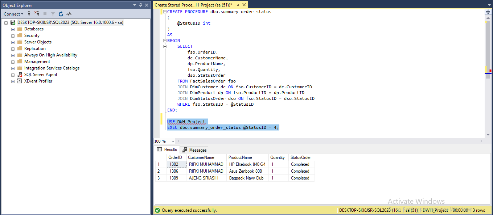
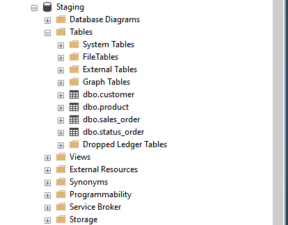
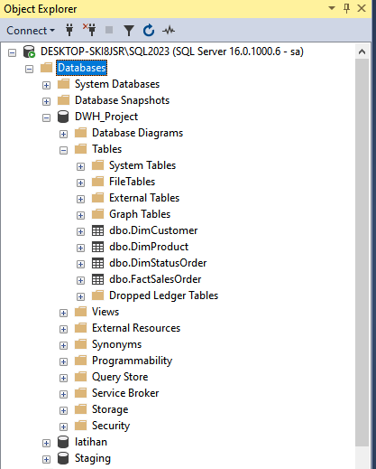
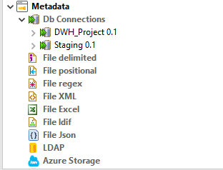
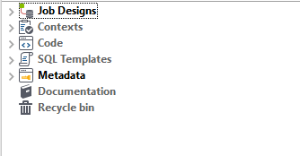
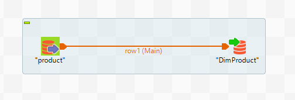
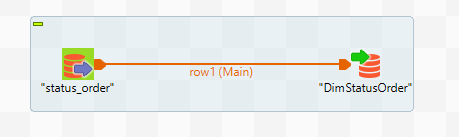
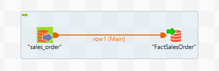
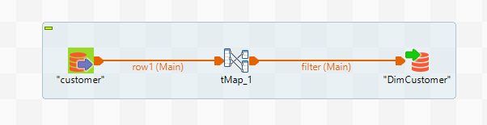
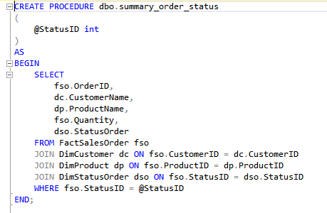

# Data Engineer Id/X Partners

# Work Environment
**Tools** : Microsoft SQL Server, SQL Server Management Studio & Talend Open Studio   
**Programming Languange** : SQL  

# Introduction
Pada case kali ini saya diminta untuk menghandle salah satu client Id/X Partners yang bergerak di bidang e-commerce, dimana client tersebut memiliki kebutuhan untuk membuat data warehouse yang berhasal dari beberapa table dari database sumber. Data warehouse ini nantinya terdiri dari satu table Fact dan beberapa table Dimansion.

# Objective
Membuat Data Warehouse dan Store Procedure untuk memenuhi kebutuhan client, dan data yang diambil berasal dari database sumber.

# Visualization
Berikut hasil dari menjalankan perintah Execute Store Procedure pada hasil akhir :

# Result
Saya berhasil membuat Data Warehouse, dan memindahkan datanya dari Database Sumber menuju Data Warhouse untuk kebutuhan client dan membuat Stored Procedure yang saya beri nama **summary_order_status** dengan menggunakan tools SQL Server, SQL Server Management Studio & Talend Open Studio. 

**Langkah Pertama** saya melakukan restore file Staging di tools SQL Server Management Studio (SSMS).

**Langkah Kedua** saya membuat database baru yang saya beri nama **DWH_Project** dan membuat beberapa table diantaranya 1 table Fact yaitu table FactSalesOrder dan beberapa table Dimansion yaitu table DimCustomer, DimProduct dan DimStatusOrder di SQL Server Management Studio (SSMS).

**Langkah Ketiga** saat menggunakan tool Talend Open Studio pada proses pemindahan data, pertama yang harus dilakukan mengkoneksikan tools Talend & SSMS terlebih dahulu. Setelah terkoneksi saya menuju **Job Design** lalu membuat lembar kerja baru untuk proses pemindahan data. Pada proses pemindahan data saya menggunakan komponen **tMSSqlInput**, dan **tMSSqlOutput**, lalu pada table customer saya melakukan transfrom pada kolom first_name dan last_name yang nanti akan saya gabungkan menjadi satu kolom di table DimCustomer yang saya beri nama kolomnya CustomerName, lalu pada huruf yang berada di kolom Customer name saya akan ubah menjadi kapital menggunakan fungsi UPCASE. Proses transform tersebut menggunakan komponen **tMap**.

_"Mengkoneksikan tools talend dengan SSMS"_

_"Menuju Job Designs untuk proses pemindahan data"_

_"Proses Pemindahan data dari Database sumber menuju Data Warehouse"_

**Langkah Kempat** saya membuat Stored Procedure yang saya beri nama summary order status, dimana stored procedure ini nantinya jika dijalankan akan menghasilkan summary customer berdasarkan status order.

Setelah semua dikerjakan client tersebut telah memiliki Data Warhouse sesuai kebutuhan.